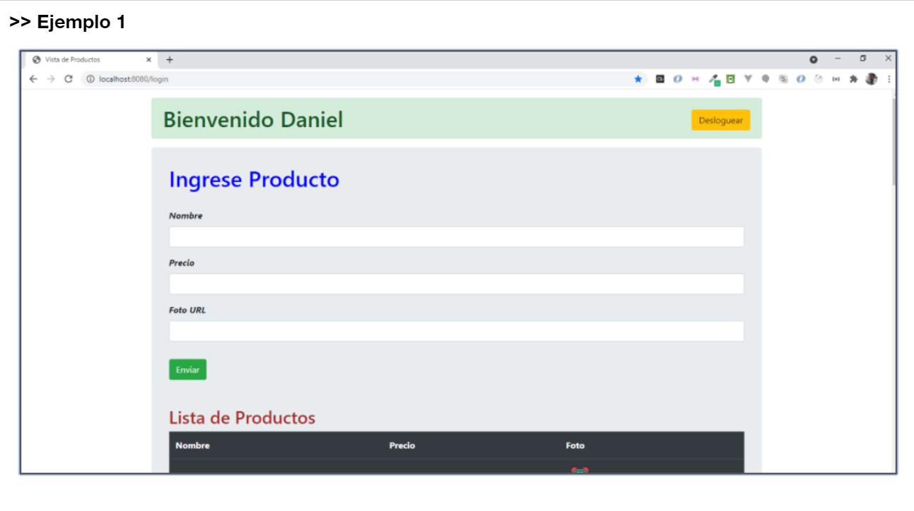
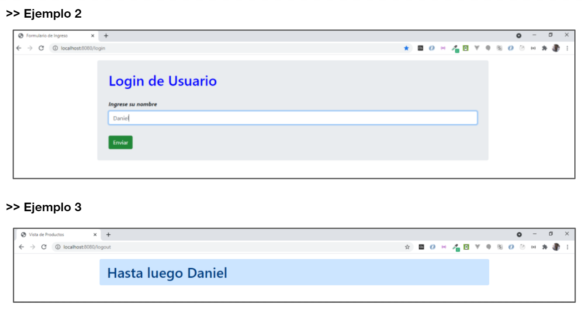

# PROGRAMACION BACKEND

# Comisión #32095

# Desafio 10

## Consigna:

---

Continuando con el desafío de la calse anterior, vamos a incorporar un mecanismo sencillo que permite loguear un cliente por su nombre, mediante un formulario de ingreso.

Luego de que el usuario esté logueado, se mostrará sobre el contenido del sitio un cartel con el mensaje "Bienvenido" y el nombre de usuario. Este cartel tendrá un botón de deslogueo a su deerecha.

Verificar que el cliente permanezca logueado en los reinicios de la página, mientras no expire el tiempo de unactividad de un minotu, se recargará con cada request. En caso de alcanzarse ese tiempo, el próximo request de usuario nos llevará al formulario de login.

Al desloguearse, se mostrará una vista con el mensaje "Hasta luego" más el nombre y se retornará automáticamente, luego de dos segundos, a la vista de login de usuario.

### Ejemplos:

---

Se adjuntan tres screenshot con las vistas anteriormente mencionadas.

### Aspectos a incluir en el entregable:

---

La solución entregada deberá persistir las sesiones de usuario en Mongo Atlas.

- Verificar que en los reinicios del servidor, no se pierdan las sesiones activas de los clientes.

- Mediante el cliente web de Mongo Atlas, revisar los id de sesión correspondientes a cada cliente y sus datos.

- Borrar una sesión de cliente en la base y vomprobar que en el próximo request al usuario se le presente la vista de login.

- Fijar un tiempo de expiración de sesión de 10 minutos recargable con cada vista del cliente al sitio y verificar que si pasa ese tiempo de inactividad el cliente quede deslogueado.

### Método de entrega:

---

Link a un repositorio en Github con el proyecto cargado

No inluir los node_modules
