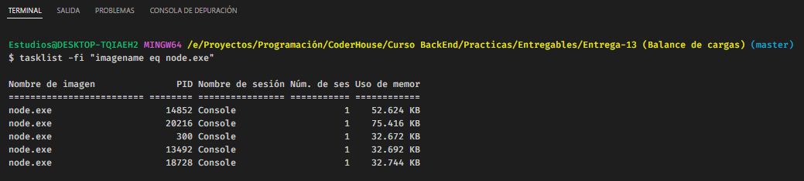

# PROGRAMACION BACKEND

# Comisión #32095

# Desafio 13 (Balance de cargas)

---

# Documentación de ejecución

---

                                                  NODE y NODEMON

Para ejecutar el servidor, ya sea con node o nodemon, se debe poner como primer parametro el puerto, luego seguido del modo de CLUSTER o FORK, si no se agrega nada, se inicia en modo FORK

Parámetros para ejecutar los servidores:

-p o (puerto) = por defecto el 8080

-m (o modo) = FORK (por defecto) o CLUSTER

- Ejemplo del modo Fork:

        nodemon index.js -p 8081 -m "FORK"       (para nodemon)
        node index.js -p 8081                    (para node)

  

- Ejemplo del modo Cluster:

  No es necesario escribir cluster en mayusculas, ya que en cualquier caso lo transforma a minúsculas

        nodemon index.js -p 8081 -m "cluster"         (para nodemon)
        node index.js -p 8081 -m "CLUSTER"            (para node)

  

---

                                                  MÓDULO FOREVER

- Ejemplo de ejecución de dos servidores con el módulo forever:

      forever start index.js -p 8081
      forever start index.js -p 8082

  

  Lista de servidores utilizando forever (mediante Forever):

  

  Lista de servidores utilizando forever (mediante el SO):

  

  Ejemplo de ambos servidores funcionando:

  

  

---

                                                  MÓDULO PM2

- Ejemplo de servidor FORK (puerto 8081) y CLUSTER (puerto 8082) con PM"

      pm2 start index.js --name="ServerFork" --watch -- 8081
      pm2 start index.js --name="ServerCluster" --watch -i 2 -- 8082

  

  Lista de procesos activos de Node.js:

  

  Ejemplo para frenar / eliminar servidores con PM2:

  
