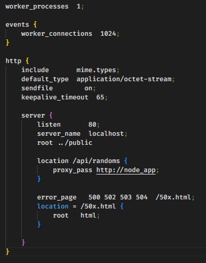
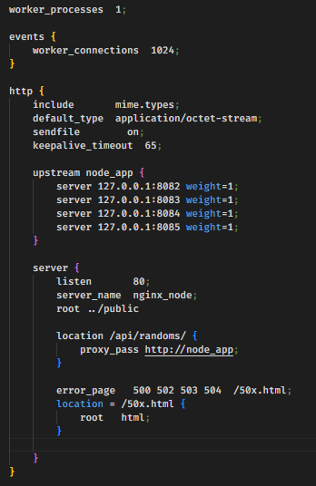

# PROGRAMACION BACKEND

# Comisión #32095

# Desafio 13 (Balance de cargas)

---

# Documentación de NGINX

---

Para esta entrega es necesario configurar ngix de dos maneras diferentes:

    1. Redirigir todas las consultas a '/api/randoms' a un cluster de servidores escuchando en el puerto 8081. El cluster será creado desde node utilizando el módulo nativo cluster.

    El resto de las consultas, redirigirlas a un servidor individual escuchando en el puerto 8080.

- Para la cual se utilizará la siguiente configuración de nginx:

  

        2. Modificar la configuración para que todas las consultas a '/api/randoms' sean redirigidas a un cluster de servidores gestionado desde ngix, repartiéndolas equitativamente entre 4 instancias escuchando en los puertos 8082,8083,8084 y 8085 respectivamente

- Para la cual se utilizará la siguiente configuración de nginx:

  

---
