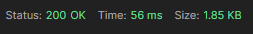
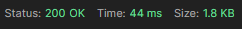
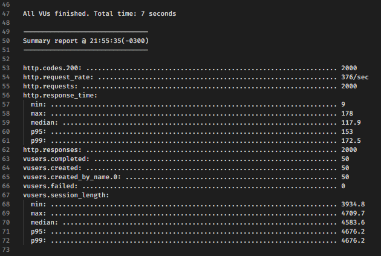
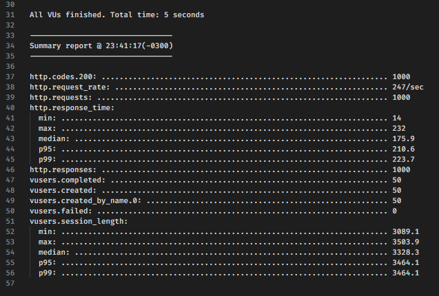

# PROGRAMACION BACKEND

# Comisión #32095

# Desafio 14 (Loggers & GZIP)

---

# Indice

---

1. [Compresión](#compresión)

2. [Logger](#logger)

3. [Artillery](#artillery)

4. [0x](#0x)

5. [Conclusión](#conclusión)

---

## Compresión

---

Peso del archivo "/info" CON compresión:

Peso del archivo "/info" SIN compresión:

---

## Logger

---

Se utilizó Log4js como logger y su configuración se encuentra dentro de la carpeta llamada "loggers"

Para utilizar los logs se deberá establecer una variable llamada "ENV" utilizando dotenv

    process.env.ENV == undefined

        - Los logs se ejecutarían de manera default (solo se mostrarían las salídas info o superiores y solo por consola)

                        -------------------

    process.env.ENV == "prod"

        - Las salidas tipo "error" o "warning" se guardarán en diferentes archivos, dentro de una carpeta llamada "logs"
        - Las salidas tipo info se mostrarán por consola

                        -------------------

    process.env.ENV == "dev"

        - Todas las salidas se mostrarán por consola (incluidas las tipo "trace" y "debug")

---

## Artillery

---

    Comandos utilizados para ejecutar el servidor con el profiler de Node.js:
    node --prof index.js
            (ejecutar el servidor con el console.log y sin el console.log)

    node --prof.process fork-console.log > result_fork-console.txt
    node --prof.process fork-noConsole.log > result_fork-noConsole.txt
            (los resultados se dejan almacenados en la carpeta "documentation")

    Comando utilizado en Artillery
    artillery quick --count 50 -n 20 http://localhost:8080/info > result.txt

---

    Servidor en modo FORK

- Ruta /info sin console.log

- Ruta /info con console.log

---

## 0x

---

---

## Conclusión

---
