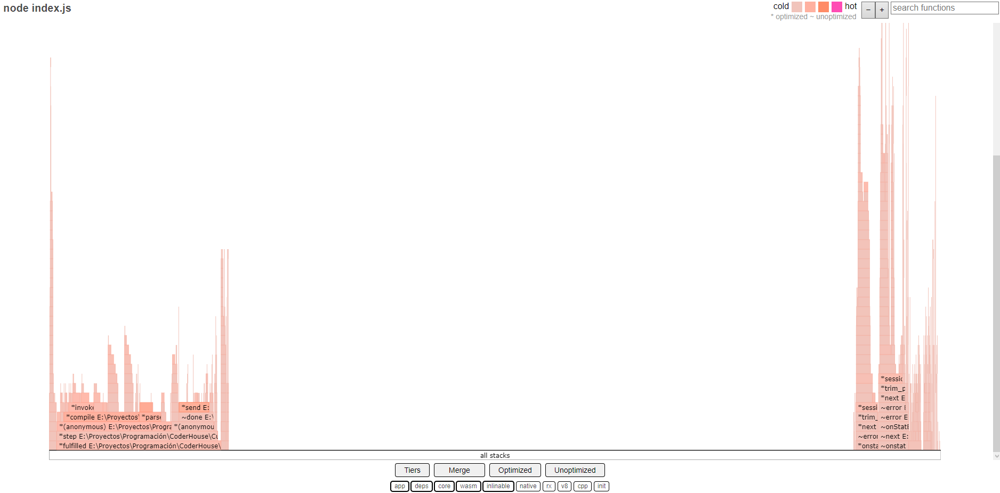

# PROGRAMACION BACKEND

# Comisión #32095

# Desafio 14 (Loggers & GZIP)

---

# Indice

---

1. [Compresión](#compresión)

2. [Logger](#logger)

3. [Artillery](#artillery)

4. [Autocannon](#autocannon)

5. [Inspect](#inspect)

6. [0x](#0x)

7. [Conclusión](#conclusión)

---

## Compresión

---

Peso del archivo "/info" CON compresión:

Peso del archivo "/info" SIN compresión:

---

## Logger

---

Se utilizó Log4js como logger y su configuración se encuentra dentro de la carpeta llamada "loggers"

Para utilizar los logs se deberá establecer una variable llamada "ENV" utilizando dotenv

    process.env.ENV == undefined

        - Los logs se ejecutarían de manera default (solo se mostrarían las salídas info o superiores y solo por consola)

                        -------------------

    process.env.ENV == "prod"

        - Las salidas tipo "error" o "warning" se guardarán en diferentes archivos, dentro de una carpeta llamada "logs"
        - Las salidas tipo info se mostrarán por consola

                        -------------------

    process.env.ENV == "dev"

        - Todas las salidas se mostrarán por consola (incluidas las tipo "trace" y "debug")

---

## Artillery

---

    Comandos utilizados para ejecutar el servidor con el profiler de Node.js:
    node --prof index.js
            (ejecutar el servidor con el console.log y sin el console.log)

    node --prof-process fork-console.log > result_fork-console.txt
    node --prof-process fork-noConsole.log > result_fork-noConsole.txt
            (los resultados se dejan almacenados en la carpeta "documentation")

    Comando utilizado en Artillery
    artillery quick --count 50 -n 20 http://localhost:8080/info > result.txt

---

           Servidor modo FORK - Comparación con Artillery

- Ruta /info sin console.log

- Ruta /info con console.log

            Servidor modo FORK - Comparación del Profiler de Node-js

- Ruta /info sin console.log

- Ruta /info con console.log

---

## Autocannon

---

Resultados del test utilizando autocannon:

- Ruta "/info" SIN console.log:

  

- Ruta "/info" CON console.log:

  

- Para ejecutarlo, se deberá inicir el servidor ("npm start") y en otra consola utilizar el siguiente comando:

  npm test

---

## Inspect

---

- Se deberá ejecutar el servidor como inspect:

  node --inspect index.js

- Luego se deberá acceder al modo inspect de chrome (URL = "chrome://inspect")

- El siguiente paso sería comenzar a grabar con el profiler de Chrome

- Después se deberá hacer un test de carga con Artillery (artillery quick --count 50 -n 20 http://localhost:8080/info > result.txt) y se deberá dejar de grabar con el profiler

- Finalmente se procede a mirar los resultados que trae el profiler

Observación:

- Es más sencillo entender lo que dice el profiler cuando se va a la seccción "Sources" y se mira por archivo (es lo que se muestra en las imagenes ubicadas debajo)

Resultados:

- Inspect de la ruta "/info" SIN console.log:

  

- Inspect de la ruta "/info" CON console.log:

  

---

## 0x

---

[Carpeta del gráfico](./0x-graph/)

---

## Conclusión

---

Actualmente el desarrollar esta actividad me llevó a varios pensamientos respecto al tema:

1. Hay que dar mucha atención a la forma en la que se trabajan las cosas a la hora de querer mejorar el rendimiento de nuestra aplicación, ya que por cambiar una sola línea de código (en este caso por un console.log) puede hacer que nuestra aplicación mejore mucho su rendimiento

2. Si bien toma un poco más de trabaja, es mejor utilizar logs a la hora de desarrollar, haciendo perfiles paraa producción y desarrollo

3. Los loggers son muy útiles a la hora de trabajar con producción, es decir, proyectos más grandes. Y log4js me resultó muy cómodo de utilizar para ello

4. Si bien hay varias maneras de medir la eficiencia de neustro servidor, la verdad es que de las utilizadas hay algunas que resultan un poco molestas a la hora de utilizarlas y no me es posible sacarles provecho de manera óptima debido a mi desconocimiento y a que hay otras opciones más sencillas de entender y trabajar

Ahora si, conclusión:

    En lo que respecta a medir el rendimiento de los diferentes endpoints que estamos utilizando me pareció que hacer tests con Artillery y el inspect de Chrome me sería lo más útil, ya que con Artillery podría ver que endpoints me parecen lentos y con el inspector de Chrome (mirando la fuente y no el profiler) podría ver cuales son las líneas de código que más recursos me consumen y donde podría optimizar

    Lo qué sí veo como una falencia en lo que acabo de decir (muy posiblemente por mi desconocimiento) es que no puedo medir endpoints en los cuales tenga autenticación de usuario (sin utilizar query params) usando Artillery
